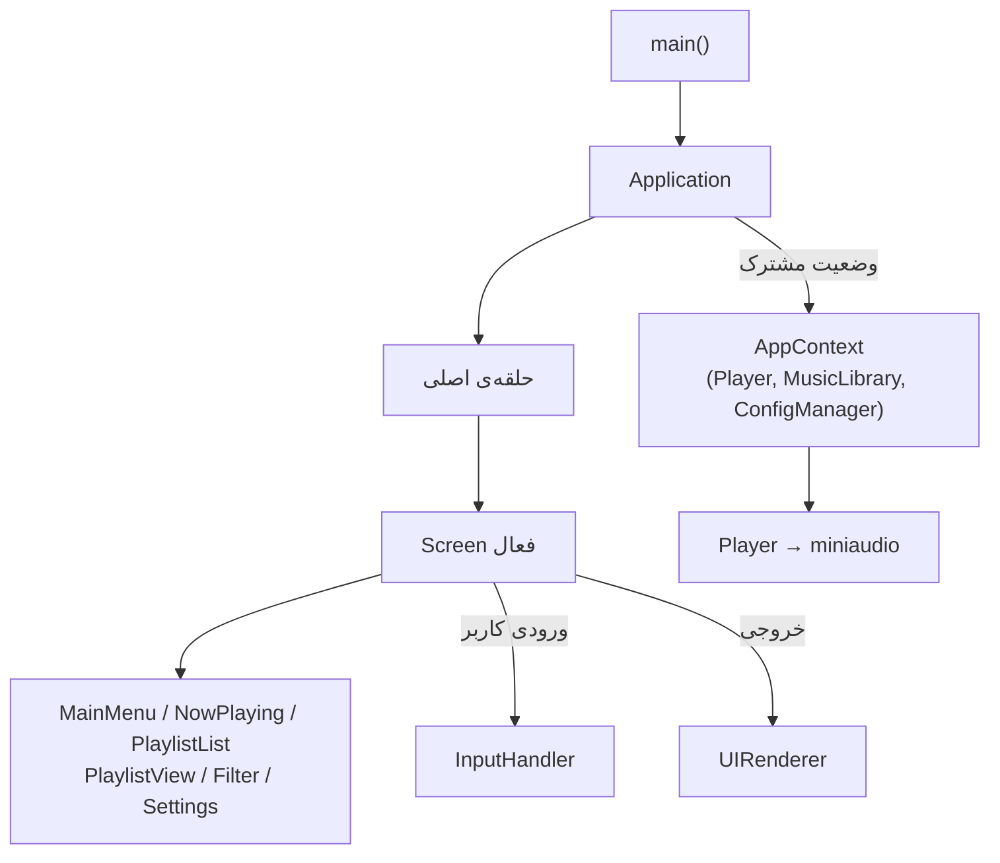

# 🎵 Music Player — پخش‌کننده‌ی موسیقی ترمینالی

یک پخش‌کننده‌ی موسیقی متن‌محور (Terminal UI) که با **C++17** و کتابخانه‌ی تک‌فایلیِ
[`miniaudio`](https://miniaud.io) نوشته شده است. کد کاملاً **شیءگرا (OOP)** است،
هر کلاس در فایل‌های `.h`/`.cpp` جداگانه قرار دارد، و معماری صوت برای پخش روان و
بدون قفل‌شدگی طراحی شده است.

> پروژه روی **ویندوز (MinGW)**، **لینوکس** و **macOS** کامپایل و اجرا می‌شود و در
> نبودِ کارت صدا (مثل WSL یا سرورهای بدون خروجی صوتی) به‌صورت خودکار وارد
> **حالت بی‌صدا** می‌شود؛ یعنی همه‌ی قابلیت‌ها کار می‌کنند، فقط صدایی پخش نمی‌شود.

---

## فهرست

- [پیش از کامپایل: فایل `miniaudio.h`](#-پیش-از-کامپایل-فایل-miniaudioh)
- [ساخت و اجرا](#-ساخت-و-اجرا)
- [قابلیت‌ها](#-قابلیتها)
- [راهنمای کلیدها](#-راهنمای-کلیدها)
- [ساختار پوشه‌ها](#-ساختار-پوشهها)
- [فرمت فایل‌های داده](#-فرمت-فایلهای-داده)
- [معماری نرم‌افزار](#-معماری-نرمافزار)
- [طراحی موتور صوت (مهم)](#-طراحی-موتور-صوت-مهم)
- [مدیریت حافظه](#-مدیریت-حافظه)
- [عیب‌یابی](#-عیبیابی)

---

## ⚠️ پیش از کامپایل:`

ماکروی `MINIAUDIO_IMPLEMENTATION` فقط و فقط در `src/Player.cpp` تعریف شده است،
پس نیازی به هیچ تنظیم دیگری ندارید.

---

## 🛠 ساخت و اجرا

همیشه از **ریشه‌ی پروژه** (پوشه‌ای که `Data/` و `Makefile` در آن قرار دارند)
بیلد و اجرا کنید؛ مسیرها نسبت به این پوشه خوانده می‌شوند.

### ویندوز (MinGW)

```powershell
mingw32-make            # کامپایل
music_player.exe        # اجرا  (یا: mingw32-make run)
mingw32-make clean      # پاک‌سازی فایل‌های ساخته‌شده
```

### لینوکس / macOS

```bash
make                    # کامپایل
./music_player          # اجرا  (یا: make run)
make clean              # پاک‌سازی
```

کد با `-std=c++17 -Wall -Wextra -O2` و **بدون هیچ هشداری (warning-free)** کامپایل
می‌شود. `Makefile` به‌صورت خودکار سیستم‌عامل را تشخیص می‌دهد و کتابخانه‌های لازم را
لینک می‌کند:

| سیستم‌عامل | بک‌اند صوتی | کتابخانه‌های لینک‌شده |
|---|---|---|
| ویندوز | WASAPI | `-lole32 -lwinmm` |
| لینوکس | ALSA / PulseAudio | `-lpthread -lm -ldl` |
| macOS | CoreAudio | — |

---

## ✨ قابلیت‌ها

- 📚 **کتابخانه‌ی موسیقی** از روی `library.csv` با عنوان، خواننده، آلبوم، ژانر، سال و مدت‌زمان.
- 🎶 **پلی‌لیست‌ها** با فرمت استاندارد `.m3u`.
- ▶️ **کنترل کامل پخش:** play / pause / resume / stop / next / previous و جابه‌جایی زمانی (seek).
- 🔁 **چهار حالت پخش:** `NO_REPEAT`، `REPEAT_ONE`، `REPEAT_ALL`، `SHUFFLE`.
- ⏱ **نوار زمان زنده** (زمان فعلی / مدت کل) که روان و بدون لگ به‌روز می‌شود.
- 🔎 **صفحه‌ی فیلتر/جستجو** برای پیدا کردن آهنگ‌ها.
- ⚙️ **ذخیره‌ی تنظیمات** (پلی‌لیست فعال، حالت پخش، و آخرین آهنگ پخش‌شده) در `settings.cfg`.
- 💾 **یادآوری آخرین آهنگ:** در اجرای بعدی، آخرین آهنگ نمایش داده می‌شود (بدون پخش خودکار).
- 🔇 **حالت بی‌صدای خودکار** وقتی هیچ دستگاه صوتی‌ای در دسترس نباشد.
- 🧱 **مقاوم در برابر خطا:** فایل‌های گم‌شده یا خراب به‌جای کرش کردن، رد می‌شوند.

---

## 🎹 راهنمای کلیدها

### منوی اصلی (Main Menu)

| کلید | عملکرد |
|---|---|
| `1` | صفحه‌ی در حال پخش (Now Playing) |
| `2` | فهرست پلی‌لیست‌ها (Playlists) |
| `3` | نمای پلی‌لیست فعلی |
| `4` | تنظیمات (Settings) |
| `0` / `q` | خروج از برنامه |

### صفحه‌ی در حال پخش (Now Playing)

| کلید | عملکرد |
|---|---|
| `p` / `P` / `Enter` | پخش / مکث / ادامه (toggle) |
| `n` / `N` | آهنگ بعدی |
| `b` / `B` | آهنگ قبلی |
| `s` / `S` | توقف (بازنشانی موقعیت به صفر) |
| `+` / `=` / `→` | جلو بردن ۱۰ ثانیه |
| `-` / `_` / `←` | عقب بردن ۱۰ ثانیه |
| `0` / `q` / `Esc` | بازگشت به منوی اصلی |

> در فهرست‌ها از کلیدهای جهت‌دار `↑`/`↓` برای حرکت و `Enter` برای انتخاب استفاده کنید.

### تفاوت `pause` و `stop`

| | `pause` | `stop` |
|---|---|---|
| موقعیت پخش | **حفظ می‌شود** | **به صفر بازنشانی می‌شود** |
| ادامه با | `resume` (از همان‌جا) | `play` (از ابتدای آهنگ) |

---

## 📁 ساختار پوشه‌ها

```
Music_Player/
├── Makefile                 # بیلد چندسکویی (ویندوز / لینوکس / macOS)
├── README.md
├── Data/
│   ├── library.csv          # کتابخانه‌ی آهنگ‌ها
│   ├── settings.cfg         # تنظیمات ذخیره‌شده
│   ├── Playlists/           # پلی‌لیست‌های .m3u
│   │   ├── Rock_Legends.m3u
│   │   ├── Instumental.m3u
│   │   ├── Disco_Dance.m3u
│   │   └── Late_Night.m3u
│   └── Musics/              # فایل‌های صوتی (mp3 و ...)
└── src/                     # کد منبع
    ├── main.cpp             # نقطه‌ی ورود + try/catch سراسری
    ├── Application.*        # حلقه‌ی اصلی و چرخش بین صفحه‌ها
    ├── AppContext.h         # وضعیت مشترکِ تزریق‌شده به صفحه‌ها
    ├── Player.*             # موتور پخش (تنها جایی که با صدا کار می‌شود)
    ├── MusicLibrary.*       # نگه‌دارنده‌ی همه‌ی آهنگ‌ها (مالک حافظه)
    ├── Playlist.* / Song.*  # مدل‌های داده
    ├── CsvLoader.* / M3uLoader.*   # خواندن کتابخانه و پلی‌لیست‌ها
    ├── ConfigManager.*      # خواندن/نوشتن settings.cfg
    ├── Screen.h             # رابط پایه‌ی صفحه‌ها
    ├── MainMenuScreen.* / NowPlayingScreen.*
    ├── PlaylistListScreen.* / PlaylistViewScreen.*
    ├── FilterScreen.* / SettingsScreen.*
    ├── UIRenderer.*         # رسم رابط کاربری در ترمینال
    ├── InputHandler.*       # خواندن کلیدها (شامل کلیدهای جهت‌دار)
    └── Utils.*              # توابع کمکی (trim، قالب‌بندی زمان، ...)
```

---

## 🗂 فرمت فایل‌های داده

### `Data/library.csv`

هر خط یک آهنگ. خط اول می‌تواند با `#` کامنت باشد و خط سرستون (`title,...`) نادیده گرفته می‌شود.

```csv
title,artist,album,genre,year,duration_sec,file_path
Almost Blue,Chet Baker,Almost Blue,Jazz,1988,219,Data/Musics/03 Chet Baker - Almost Blue.mp3
```

| ستون | توضیح |
|---|---|
| `title` | عنوان آهنگ |
| `artist` | خواننده |
| `album` | آلبوم |
| `genre` | ژانر |
| `year` | سال |
| `duration_sec` | مدت‌زمان به ثانیه (برای نمایش نوار زمان) |
| `file_path` | مسیر فایل صوتی نسبت به ریشه‌ی پروژه |

### `Data/Playlists/*.m3u`

فرمت استاندارد M3U؛ خطِ `#EXTM3U` و خطوط `#` نادیده گرفته می‌شوند و بقیه مسیر فایل‌ها هستند:

```
#EXTM3U
Data/Musics/02 Queen - We Are The Champions (Remastered 2011).mp3
Data/Musics/01 Pink Floyd - Hey You.mp3
```

### `Data/settings.cfg`

زوج‌های `کلید=مقدار` که هنگام خروج ذخیره و در اجرای بعدی بازیابی می‌شوند:

```ini
active_playlist=Rock_Legends
last_song=Data/Musics/02 Queen - We Are The Champions (Remastered 2011).mp3
playback_mode=NO_REPEAT
```

---

## 🏗 معماری نرم‌افزار

برنامه از الگوی **حلقه‌ی اصلی + صفحه‌ها (Screens)** پیروی می‌کند:



- **`Application`** حلقه‌ی اصلی را اجرا می‌کند، صفحه‌ی فعال را نگه می‌دارد و بین صفحه‌ها جابه‌جا می‌شود.
- **`AppContext`** وضعیت مشترک (پلیر، کتابخانه، تنظیمات) را به هر صفحه تزریق می‌کند.
- هر **`Screen`** یک رابط مشترک دارد: ورودی را پردازش و خروجی را رسم می‌کند و شناسه‌ی صفحه‌ی بعدی را برمی‌گرداند.
- **`Player`** تنها نقطه‌ای است که با `miniaudio` کار می‌کند؛ بقیه‌ی برنامه از صدا کاملاً جداست.
- در `main()` یک **`try/catch` سراسری** تضمین می‌کند برنامه هرگز با استثنای مدیریت‌نشده بسته نشود.

---

## 🔊 طراحی موتور صوت (مهم)

بخش صوت با دقت طراحی شده تا هم **بدون قفل‌شدگی (deadlock)** باشد و هم **پخش روان**
ارائه دهد. دو اصل کلیدی:

### ۱) دستگاه دائمی + دیکودر قابل‌تعویض

یک **دستگاه پخش (`ma_device`) فقط یک‌بار** ساخته می‌شود و تا پایان عمر برنامه روشن
می‌ماند؛ هنگام تعویض آهنگ، دستگاه **هرگز** نابود یا بازساخته نمی‌شود. هر آهنگ به‌صورت
یک **دیکودر منفعل (`ma_decoder`)** باز می‌شود و موقع تعویض آهنگ فقط **اشاره‌گرِ دیکودر**
زیر یک قفل بسیار کوتاه عوض می‌شود.

> چرا؟ تخریب یک صدای در حال پخش روی بک‌اند صوتی ویندوز می‌تواند قفل کند (علامتش:
> فریز شدن رابط کاربری هنگام «بعدی» در حالی که صدا همچنان پخش می‌شود و پروسه‌های
> سرگردان `music_player.exe` باقی می‌مانند). با نگه‌داشتن همیشگیِ دستگاه و تعویض صرفِ
> یک دیتاسورس منفعل، این کلاسِ کامل از قفل‌شدگی‌ها حذف شده است.

### ۲) نمایش زمان کاملاً قفل‌آزاد (lock-free)

ترد رابط کاربری **هیچ‌وقت** قفل صوتی را نمی‌گیرد. ترد صوتی موقعیت پخش را در یک متغیر
`std::atomic` منتشر می‌کند و رابط کاربری آن را بدون قفل می‌خواند. مدت‌زمان کل هم از
متادیتای `library.csv` خوانده می‌شود (یا فقط یک‌بار هنگام لود کش می‌شود).

> چرا؟ خواندنِ طول فایل از دیکودر در هر فریم (که برای MP3های سنگین/VBR کل فایل را اسکن
> می‌کند) و آن‌هم زیر قفل صوتی، ترد صوت را بلاک می‌کرد و باعث **بریده‌بریده شدن صدا**
> می‌شد. با قفل‌آزاد کردنِ نمایش زمان، ترد صوت دیگر منتظر چیزی نمی‌ماند و صدا روان است.

**خلاصه‌ی همگام‌سازی نخ‌ها:**

| داده | نویسنده | خواننده | محافظت |
|---|---|---|---|
| اشاره‌گر دیکودر | ترد اصلی (تعویض آهنگ) | ترد صوتی (callback) | `std::mutex` (کوتاه) |
| موقعیت/طول پخش | ترد صوتی / seek / stop | ترد رابط کاربری | `std::atomic` (بدون قفل) |
| پایان آهنگ | ترد صوتی | ترد اصلی (`tick`) | `std::atomic` |

---

## 🧠 مدیریت حافظه

- مالکیت آهنگ‌ها فقط با **`MusicLibrary`** است؛ در نابودگرش همه‌ی `Song*`ها آزاد می‌شوند.
- `Playlist` و `Application` صرفاً به آهنگ‌ها **اشاره** می‌کنند و آن‌ها را آزاد نمی‌کنند (بدون آزادسازی دوگانه).
- در هر لحظه فقط **یک دیکودر** زنده است؛ دیکودر قبلی هنگام تعویض آهنگ آزاد می‌شود، پس مصرف حافظه به یک آهنگ محدود می‌ماند و نشتی رخ نمی‌دهد.
- در نابودگر `Player` ابتدا **دستگاه متوقف** می‌شود (تا ترد صوتی تمام شود) و سپس دیکودر آزاد می‌شود — همین ترتیب، خاموشیِ تمیز و بدون پروسه‌ی سرگردان را تضمین می‌کند.

---

## 🩺 عیب‌یابی

| نشانه | علت / راه‌حل |
|---|---|
| پیام «running in silent mode» | هیچ دستگاه صوتی‌ای پیدا نشد (مثل WSL یا SSH). برنامه بدون صدا کامل کار می‌کند؛ روی ویندوز بومی صدا دارید. |
| خطای `miniaudio.h: No such file` | فایل اصلی `miniaudio.h` را در `src/` کپی کنید (بخش بالا). |
| آهنگی پخش نمی‌شود و رد می‌شود | فایل در `file_path` وجود ندارد یا قابل دیکود نیست؛ برنامه عمداً آن را رد می‌کند. مسیرها را در `library.csv`/`.m3u` بررسی کنید. |
| متن به‌هم‌ریخته در `cmd` | از Windows Terminal یا PowerShell استفاده کنید (پشتیبانی بهتر از ANSI/UTF-8). |
| برنامه را حتماً از ریشه‌ی پروژه اجرا کنید | مسیرها نسبت به پوشه‌ای که `Data/` در آن است خوانده می‌شوند. |

---

<div align="center">

ساخته‌شده با ❤️ و C++17 — *Computer Assignment 4*

</div>
